# How to deploy your own Pokemon Auto Chess

The guide goal is to show you how to deploy Pokemon Auto Chess in different providers. At the end of the tutorial, you will have your own pokemon auto chess server like https://pokemon-auto-chess-505f643cbc85.herokuapp.com/.

### Prerequisites

- Minimum Javascript knowledge

# Getting started

## Fork the repository

To setup your own server, you need to have full control of your own pokemon auto chess repository. To do so, fork the main repository  ( [https://github.com/keldaanCommunity/pokemonAutoChess/tree/master](https://github.com/keldaanCommunity/pokemonAutoChess/tree/master) )

### Database Hosting (Free)

Together with the node js app/server, you need to setup a MongoDB Database. The free plans cover all our needs. No billing required in this part: 

- Sign up in [MongoDB Atlas](https://www.mongodb.com/atlas/database)
- Create a cluster 
- Select the free M0 plan and the provider you want (AWS, Google Cloud or Azure)
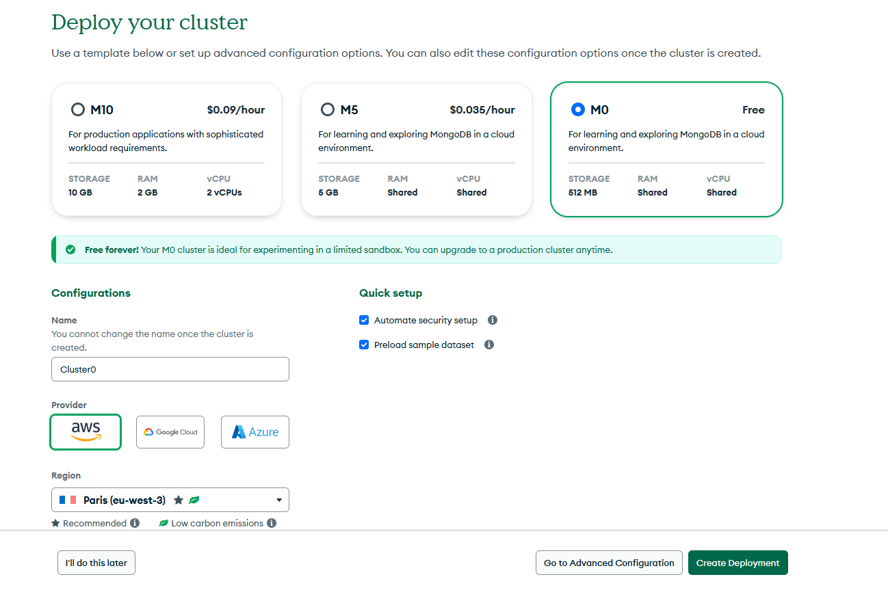
- The cluster will auto generate an admin user
- With this cluster created, you need to retrieve the mongodb connection uri. This uri must remain secret. To retrieve it, in "Connect", choose the "Drivers" method and copy the uri. Make sure to replace <password> wtih the password generated with the newly created admin user (You can see you admin credentials in Database access menu).
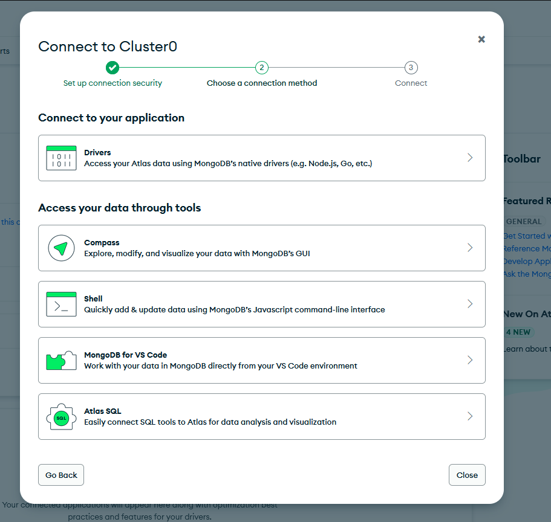
- In Network access section, add "allow access from anywhere" in the "add ip address" section.


### Authentication Hosting (Free)

- Sign up in [Firebase](https://console.firebase.google.com/u/5/)
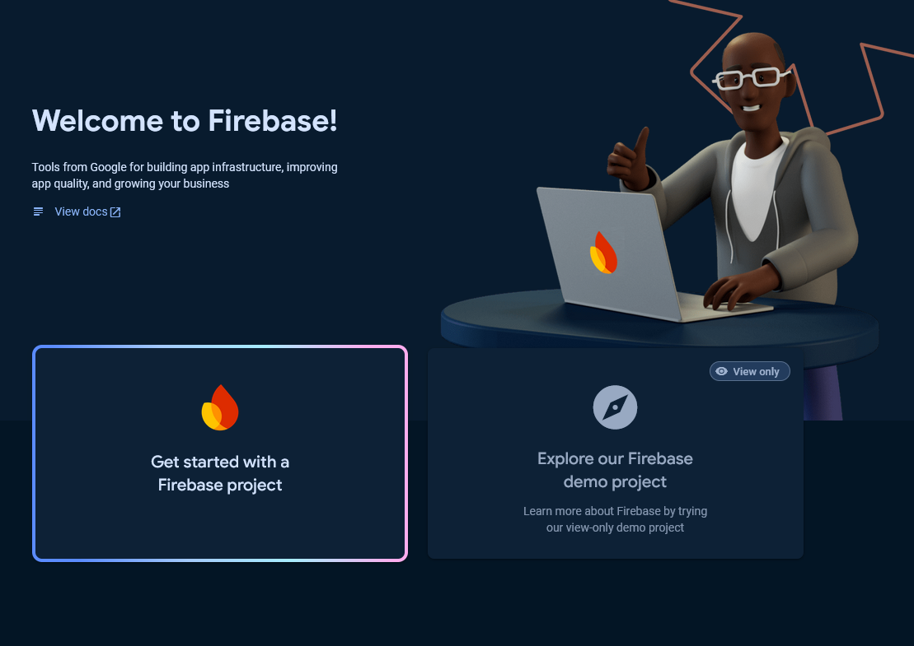
- Create a project named for example "pokemon-auto-chess" and disable google analytics 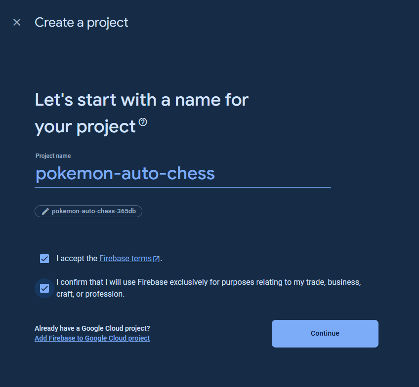
- In the authentication, add the Email/ Anonymous / Google provider
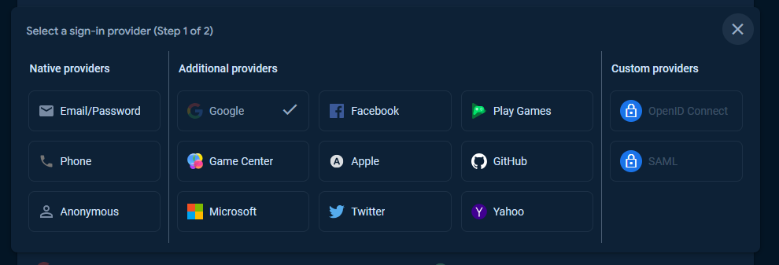
The google provider needs a valid redirect uri. Go to the your google console api and add the correct uri when your game will be deployed.
- In project overview, Project settings, Service accounts, Generate a new private key
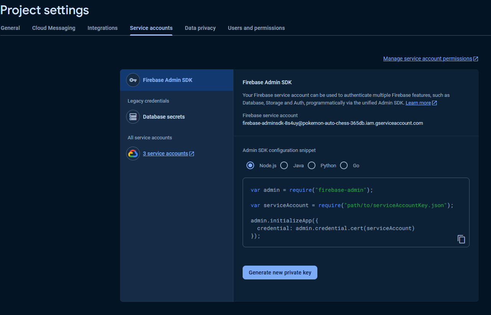
- Keep all the informations contained in the json private key secret. Those informations will be needed when filling the server environment variables.
- In Firebase, setup a Firebase Web SDK, "Add Firebase to your web app" and keep all generated secrets. Those informations will be needed when filling the server environment variables.
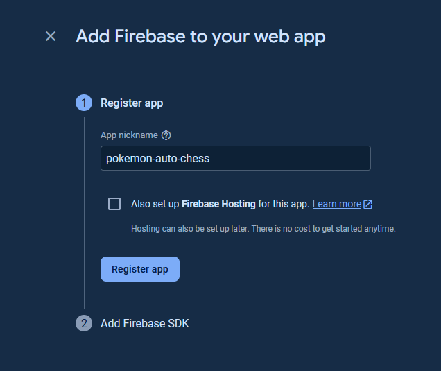

### Server hosting: deploy With Heroku ($7/month)

With a Basic dyno type, you can host your own small server. Follow the steps:

- Create a Heroku account
- Create an app, with the name you want (ex: pokemon-auto-chess)
- Link your github account to your heroku account
- In Deploy tab, "Connect your app to github" section, you can link your own fork of pokemon auto chess to your heroku account

Once your own pokemon auto chess fork is linked, you will the option either to :
- manually deploy the branch you want
- Automatic deployment when you push something on Github
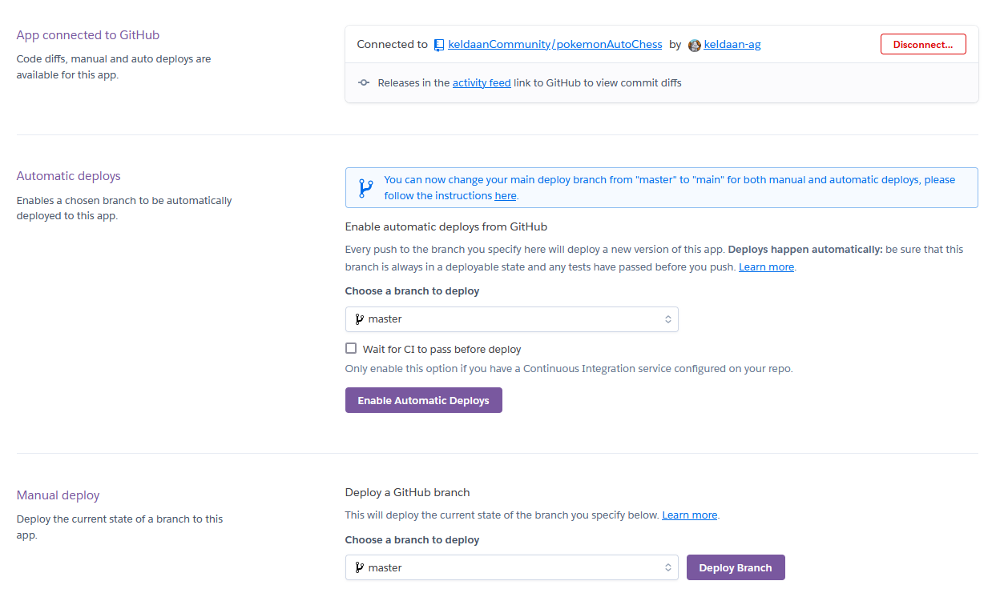
- In settings, domain part, you have the url of your newly created app

- In Firebase, add this url to authentication settings Authorized domains 
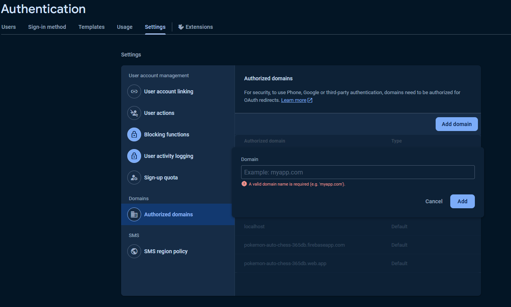

Before you deploy, make sure to correctly fill all the required environment variables
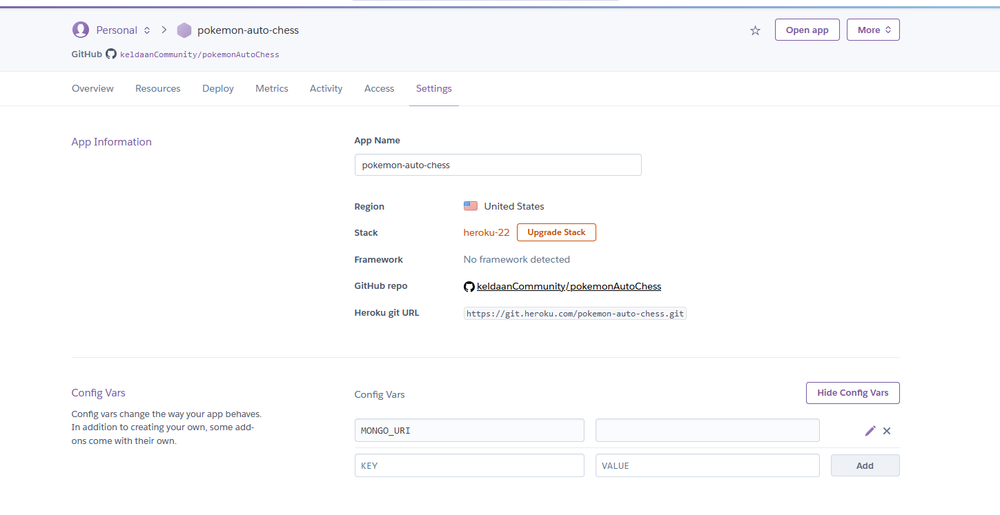

Required environment variables:
```
// from MongoDB
MONGO_URI=<The mongo URI from your atlas mongodb cluster>

// from Firebase Web SDK
FIREBASE_API_KEY=<firebase_api_key>
FIREBASE_AUTH_DOMAIN=<firebase_auth_domain>
FIREBASE_PROJECT_ID=<firebase_project_id>
FIREBASE_STORAGE_BUCKET=<firebase_storage_bucket>
FIREBASE_MESSAGING_SENDER_ID=<firebase_messaging_sender_id>
FIREBASE_APP_ID=<firebase_app_id>

// from Firebase Authentication private key
FIREBASE_CLIENT_EMAIL=<client_email>
FIREBASE_PRIVATE_KEY=<private_key>
```

For some reasons, `npm run assetpack` during build phase does not work on Heroku. To work around this issue, you'll need to:

 - Install the game locally. Steps are detailled in the readme. If you want the same environment than your production branch, you can copy all the required environment variables to your local .env.
 - `npm run build` 
 - In the `gitignore`, remove all mentions of "dist" folder, since it is the folder you want to commit on the master branch
 - In `package.json`, remove `npm run assetpack` from the `npm run build` command. 
 
 - Commit the build folder to your master branch

To help you, you can take a look at https://github.com/keldaanCommunity/pokemonAutoChess/tree/heroku that follows the same step as the tutorial

Now, you can manually deploy your application in heroku website and test if everything works !
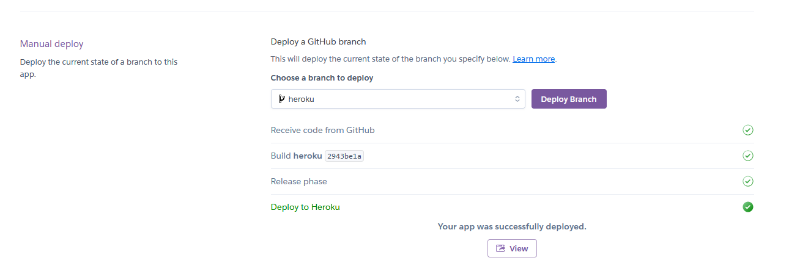

### Configuration

There are extra server environment variables that you can add in your `.env` / Configuration variables.

- `DISCORD_SERVER`: Add your discord invite url if you have your own discord
- `MIN_HUMAN_PLAYERS`: You can set a minimum human players per room limit

### Adding bots

In MongoDB Compass, you can import bots data (`./db-commmands/botv2.json`) in the `botV2` empty collection.

### IaaS Multi process VS PaaS Single process

This tutorial only focus on small single process servers in Platform as a service environment. Getting a multi process server running is way more complex and requires both lots of server architecture knowledge and an infrastructure as a service host. 

### Legal considerations

When hosting your own server for Pokemon Auto Chess, there are several legal considerations to keep in mind:

- Intellectual Property (IP) Rights: All rights to the Pokemon Company. Pokemon Auto Chess can stop at any time, whenever The Pokemon Company wants.

- Privacy and Data Protection: You’ll need to comply with data protection laws (such as GDPR in the EU) and inform players about data collection and usage. To do so, you can customize your own [policy](https://github.com/keldaanCommunity/pokemonAutoChess/blob/master/policy.md). Be sure to replace `keldaan.ag@gmail.com` by your own address.

- (Discord) Discord terms of Service: Draft clear rules for your discord server. Specify rules, behavior guidelines, and consequences for violations. Players should agree to these terms before playing.
